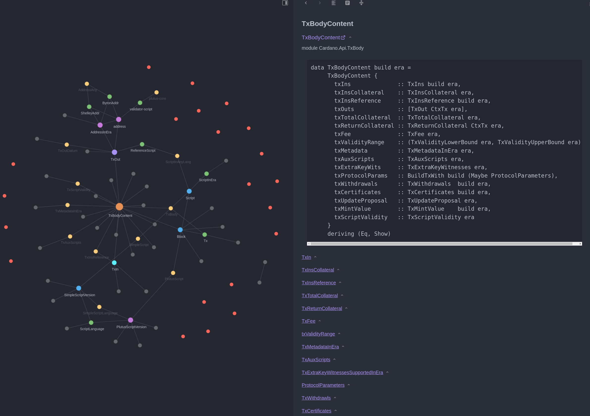

My-Notes

--
## What is this
These are my study notes using [org-roam](https://www.orgroam.com/manual.html). The main focus of the notes at this time is [Cardano-API](https://input-output-hk.github.io/cardano-node/cardano-api/lib/Cardano-Api.html)

## How to use it
The notes are emacs roam compatible. Although I have not done this, but one should be able to clone the repo and import the file into [org-roam v2](https://blog.jethro.dev/posts/org_roam_v2/) e

